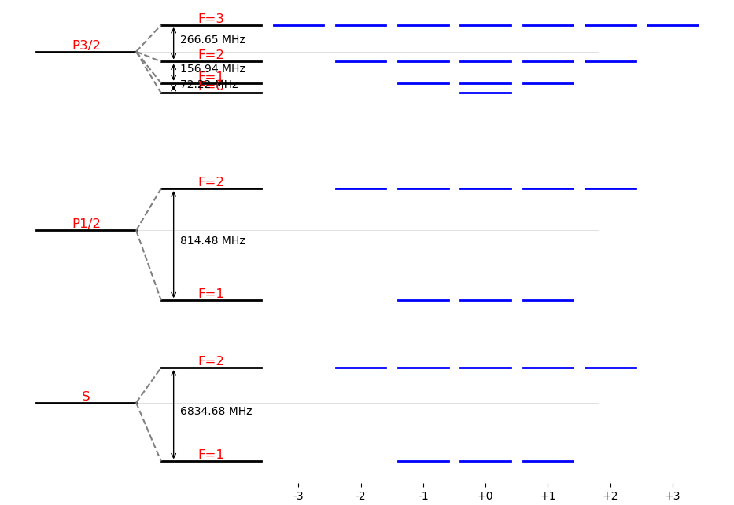
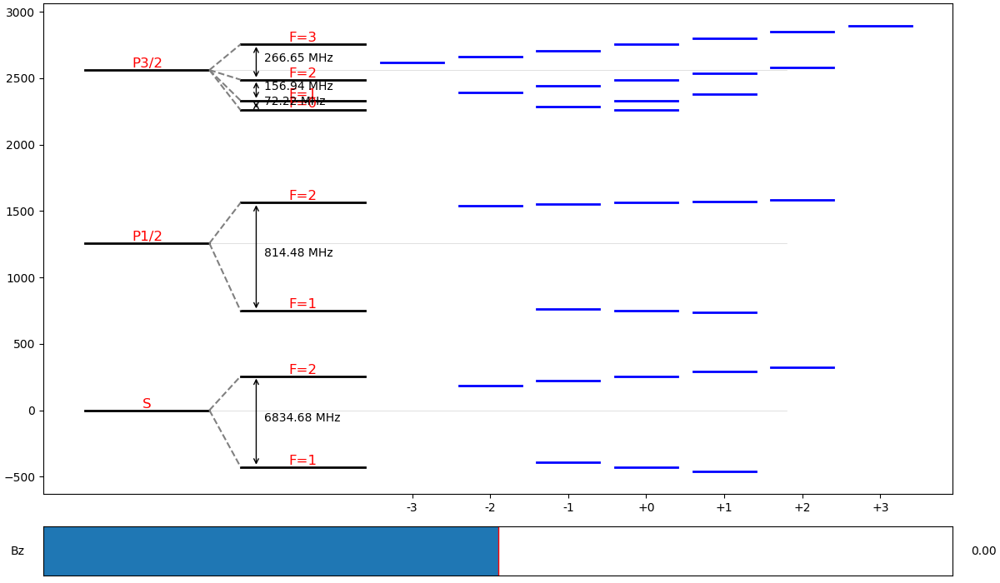
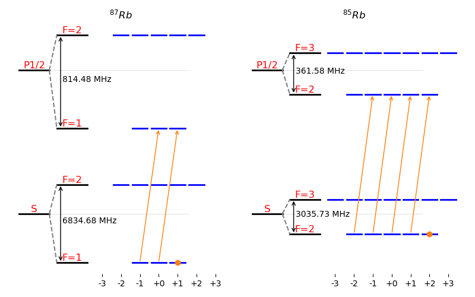
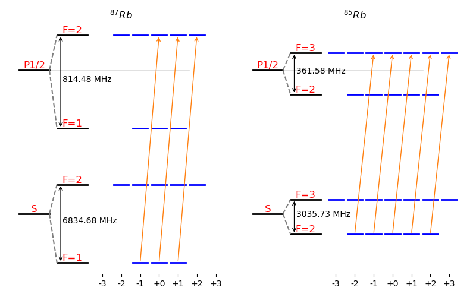
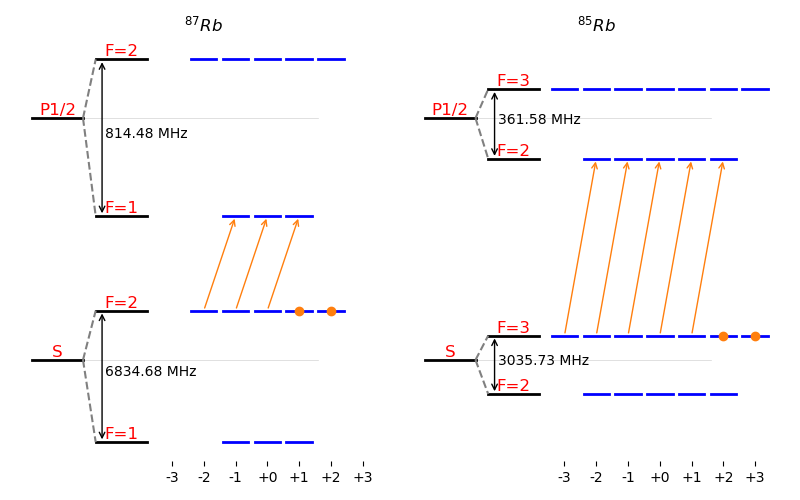
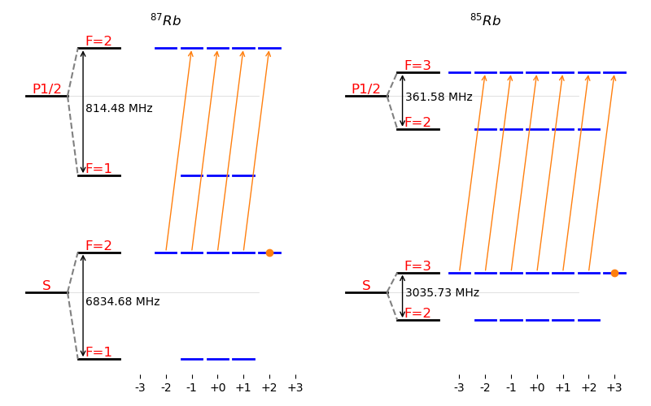

# Capítulo 6: Estructura atómica del Rubidio

En el archivo:
  * [graficar_estructura.py](graficar_estructura.py)

Se realizan una serie de gráficos de la estructura electrónica del Rubidio para las líneas D1 y D2.

