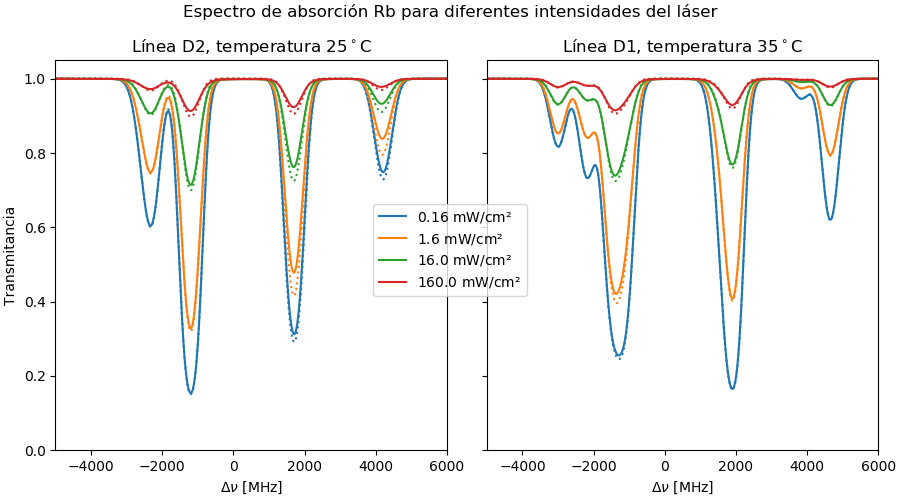
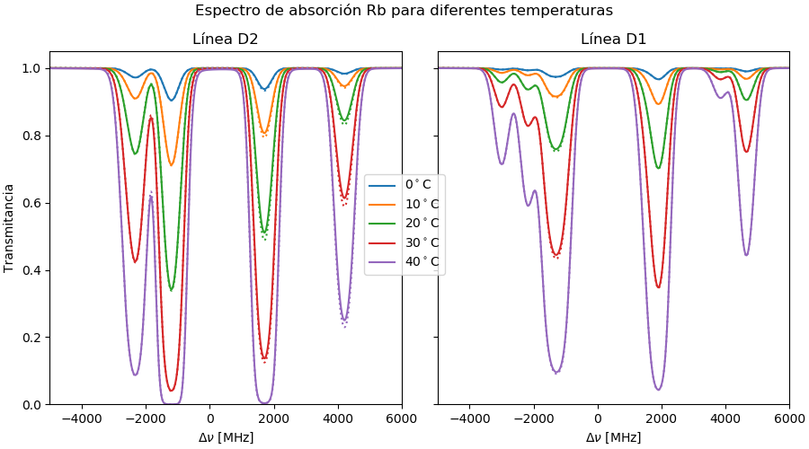
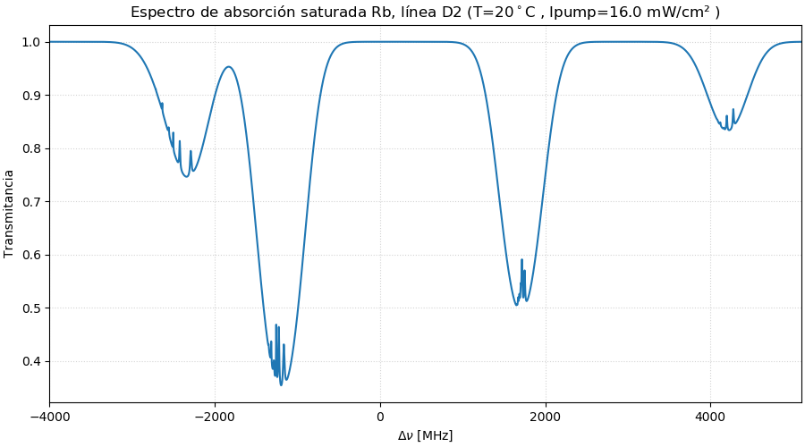

# Capítulo 7: Modelo de espectroscopía de absorción

Se desarrolló un modelo aproximado para predecir el espectro de absorción de una celda de Rubidio.

  * Modelo de cálculo: [modelo_Rb.py](modelo_Rb.py)
  * Parámetros para el Rubidio: [Rb.json](Rb.json)

Ejemplos de espectros obtenidos

## Espectro de absorción para diferentes intensidades



Código:
```python
from numpy import *
from matplotlib import pyplot as plt
from modelo_Rb import ATOM

rb = ATOM('Rb.json')

fig,axx   = plt.subplots(1,2,figsize=(9,5), constrained_layout=True , sharey=True )
barrido_I = [1.6,16,160,1600]
T         = 25

ax = axx[0]
rb.set_D(2)
rb.calc_transitions()
for I in barrido_I:
    rb.calc_transmision(I=I,T=T)
    rb.plot_transmision(ax=ax , label=f'${I/10}$ mW/cm²')

    rb.calc_transmision2(I=I,T=T)
    rb.plot_transmision(ax=ax , ls=':', color=ax.lines[-1].get_color())
ax.set_xlim(-5000,6000)
ax.set_title(f'Línea {rb.DD}, temperatura ${T}^\circ$C')

T         = 35
ax = axx[1]
rb.set_D(1)
rb.calc_transitions()    

for I in barrido_I:
    rb.calc_transmision(I=I,T=T)
    rb.plot_transmision(ax=ax )

    rb.calc_transmision2(I=I,T=T)
    rb.plot_transmision(ax=ax  , ls=':', color=ax.lines[-1].get_color())
ax.set_xlim(-5000,6000)
ax.set_title(f'Línea {rb.DD}, temperatura ${T}^\circ$C')

h1, l1 = axx[0].get_legend_handles_labels()
fig.legend(h1, l1, loc='center')

for ax in axx:
    ax.set_xlabel(r"$\Delta \nu$ [MHz]")
    ax.set_ylim(0,1.05)
axx[0].set_ylabel(r"Transmitancia")
fig.suptitle(f"Espectro de absorción Rb para diferentes intensidades del láser")
```

---------

## Espectro de absorción para diferentes temperaturas



Código:
```python
from numpy import *
from matplotlib import pyplot as plt
from modelo_Rb import ATOM

rb = ATOM('Rb.json')

fig,axx = plt.subplots(1,2,figsize=(9,5), constrained_layout=True , sharey=True )
barrido_temperatura = [0,10,20,30,40]
I = 16*0.1

ax = axx[0]
rb.set_D(2)
rb.calc_transitions()
for T in barrido_temperatura:
    rb.calc_transmision(I=I,T=T)
    rb.plot_transmision(ax=ax , label=f'${T}^\\circ$C')

    rb.calc_transmision2(I=I,T=T)
    rb.plot_transmision(ax=ax , ls=':', color=ax.lines[-1].get_color())
ax.set_xlim(-5000,6000)
ax.set_title(f'Línea {rb.DD}')

ax = axx[1]
rb.set_D(1)
rb.calc_transitions()    

for T in barrido_temperatura:
    rb.calc_transmision(I=I,T=T)
    rb.plot_transmision(ax=ax )

    rb.calc_transmision2(I=I,T=T)
    rb.plot_transmision(ax=ax  , ls=':', color=ax.lines[-1].get_color())
ax.set_xlim(-5000,6000)
ax.set_title(f'Línea {rb.DD}')

h1, l1 = axx[0].get_legend_handles_labels()
fig.legend(h1, l1, loc='center')

for ax in axx:
    ax.set_xlabel(r"$\Delta \nu$ [MHz]")
    ax.set_ylim(0,1.05)
axx[0].set_ylabel(r"Transmitancia")
fig.suptitle(f"Espectro de absorción Rb para diferentes temperaturas")
```
---------

## Espectro de absorción saturada para la línea D2




Código:
```python
from numpy import *
from matplotlib import pyplot as plt
from modelo_Rb import ATOM

rb = ATOM('Rb.json')

I           = 16*0.1    # W/m²
T           = 20        # Temperatura en grados Centigrados
rb.L        = 0.075     # largo de la celda: 7.5 cm
I_pump      = 16*10
rb.set_D(2)             # Línea D2
rb.presure_equation=0   # Ecuación para definir presión

rb.calc_transitions()
fig,ax = plt.subplots(1,1,figsize=(9,5), constrained_layout=True , sharex=True )

rb.calc_transmision_sat(I=16*0.1,T=T, Ip=I_pump)
rb.plot_transmision(ax=ax , color='C0')
ax.set_xlim(-4000,5100)

ax.set_xlabel(r"$\Delta \nu$ [MHz]")
ax.set_ylabel(r"Transmitancia")
ax.grid(b=True,linestyle= ':',color='lightgray')
ax.set_title(f"Espectro de absorción saturada Rb, línea {rb.DD} (T=${T}^\circ$C , Ipump={I_pump/10} mW/cm² )")

```
---------
