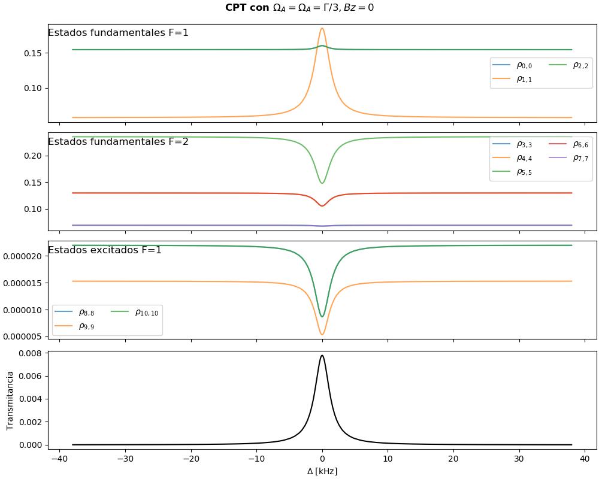

# Capítulo 8: Modelo de atrapamiento coherente de población (CPT)

Se desarrolló un modelo para obtener la evolución de la [matriz densidad](https://en.wikipedia.org/wiki/Density_matrix) que describe a un átomo de 3 niveles o de 11 niveles, cuando interactúa con un haz láser bicromático en condición de resonancia Raman.
Se busca reproducir el efecto de [transparencia inducida por CPT](https://en.wikipedia.org/wiki/Dark_state).

El modelo está basado en el trabajo de:
**Z Warren**, M S Shahriar, R Tripathi y G S Pati. *“Experimental and theoretical comparison of different optical
excitation schemes for a compact coherent population trapping Rb vapor clock”*. En: Metrologia 54.4 (jun. de
2017), págs. 418-431. DOI : [10.1088/1681-7575/aa72bb](https://doi.org/10.1088/1681-7575/aa72bb)

  * Modelo de cálculo: [modelo_Rb.py](../cap07/modelo_Rb.py)
  * Parámetros para el Rubidio: [Rb.json](Rb.json)

## Modelo de 3 niveles

Archivo:
 * [modelo_cpt_3_niveles.py](modelo_cpt_3_niveles.py)

Estructura:

Gráficos de algunos resultados a modo de ejemplo:

   

---------

## Modelo de 11 niveles
Este modelo busca reproducir parcialmente la fenomenología asociada a la línea D1 del Rubidio 87, para el estado hiperfino excitado F'=1. (ver [Rubidium 85 D Line Data, D. Steck](https://steck.us/alkalidata/rubidium85numbers.pdf)).
Incorpora corrimiento Zeeman.

Archivo:
 * [modelo_cpt_11_niveles.py](modelo_cpt_11_niveles.py)

Estructura:

Gráficos de algunos resultados a modo de ejemplo:

 
