# Capítulo 9: Espectroscopía de absorción de gas de Rb usando un microcontrolador Arduino

Se montó un sistema de actuadores para controlar un ECDL y realizar un experimento de espectroscopía de absorción saturada, como en este esquema:

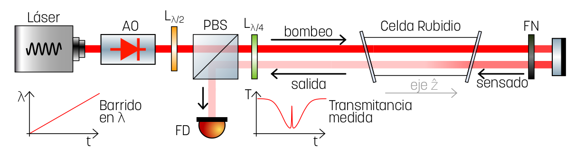

Se implementó un algoritmo de estabilización a un pozo de transmitancia, adquiriendo porciones del espectro en el entorno de longitud de onda del láser, realizando un ajuste lineal y corrigiendo la en función del valor de la pendiente. Aquí se puede ver una animación del programa en funcionamiento:

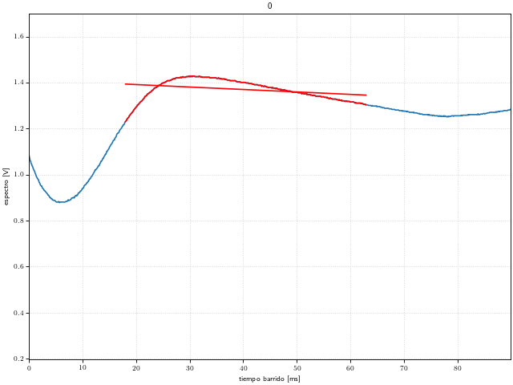


Para ello se debió controlar:
  - Corriente del láser
  - Temperatura del láser
  - Posición de la red de difracción, emdiante una tensión en un PZT

Se desarrollaron circuitos controladores para cada una de estas variables físicas. También se desarrolló un sistema de instrumentación basado en Arduino que funcionó como un comando central de operación.

## Controladores

### Controlador de PZT

Simplemente es un circuito de adaptación para el integrado [E-661.OE](hojas_de_datos/e-660_userpz45e223.pdf). Tiene un canal de control de off-set y otro de barrido.
El de off-set puede ser controlado por una entrada PWM  o mediante un potenciómetro multivuelta.
El de barrido por una entrada BNC o por otro PWM. Los canale se configuran mediante dos jumpres.

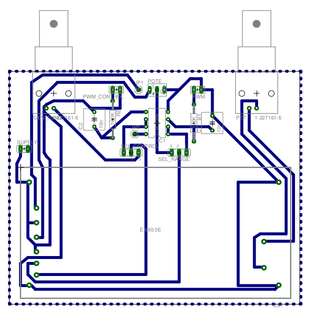
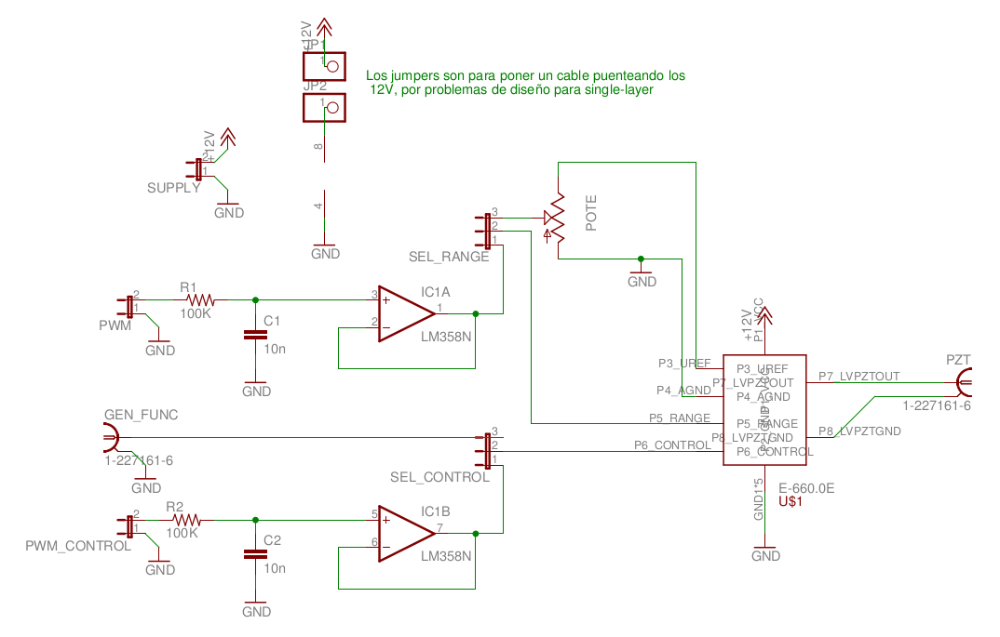


-------

<p align="center">
<strong>
<a href="DriverPZT">Driver PZT</a>
</strong>
</p>

-------


### Controlador de Corriente

Es un circuito de adaptación de tensiones para controlar el integrado [FL500](hojas_de_datos/fl500.pdf), que es una fuente de corriente de hasta 500 mA.
Tiene un control de off-set t un control de barrido, que incluye atenuación variable y la posibilidad de invertir la dirección de barrido respecto a la señal de control de entrada.


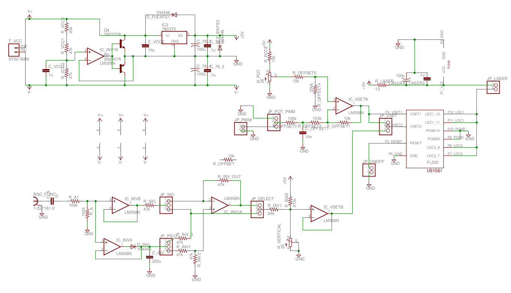
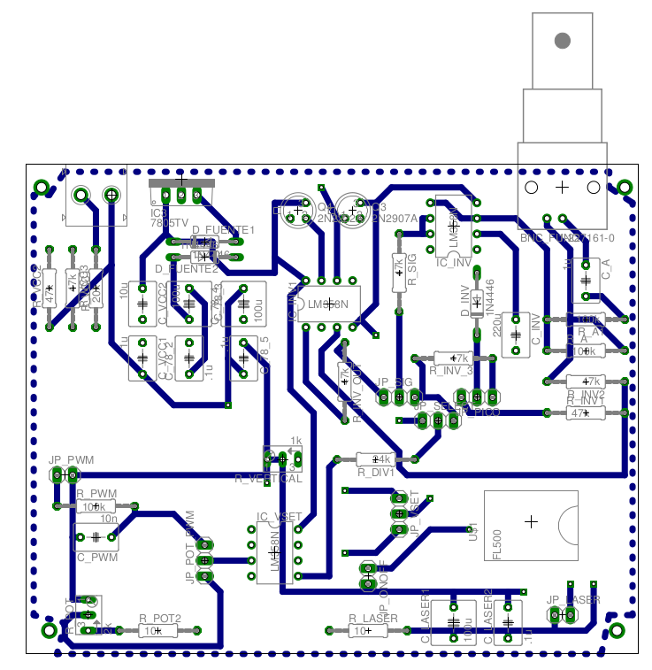 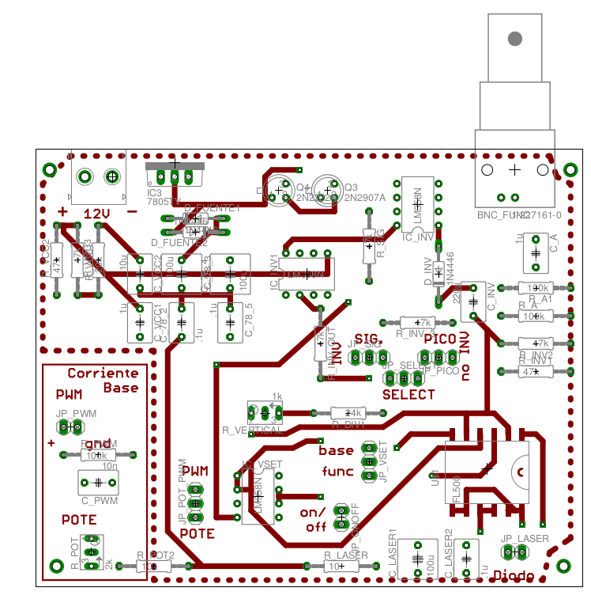

-------

<p align="center">
<strong>
<a href="DriverFL500">Driver Corriente</a>
</strong>
</p>

-------


### Controlador de Temperatura

Es un circuito de realimentación negativa con un controlador PID para estabilizar la temperatura del láser. Actúa sobre una celda Peltier y sensa un terminstor, que es comparado con una tensión de referencia.


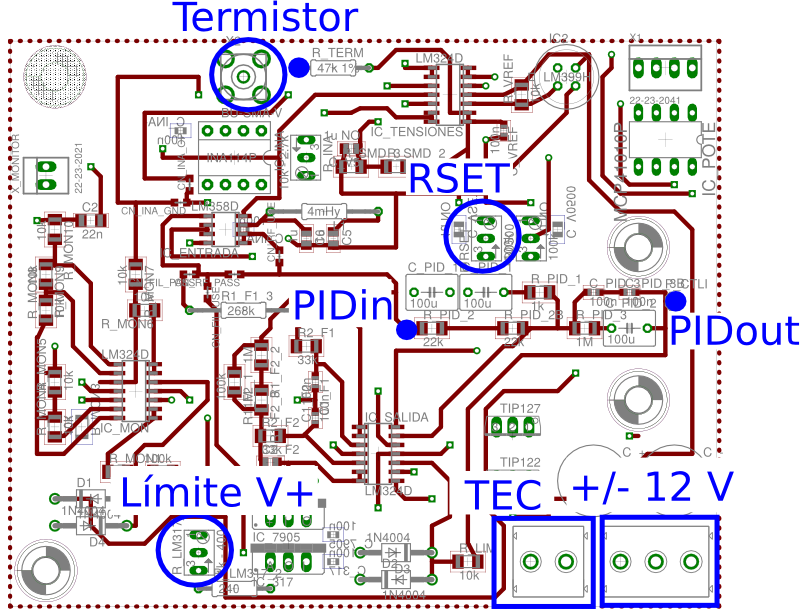
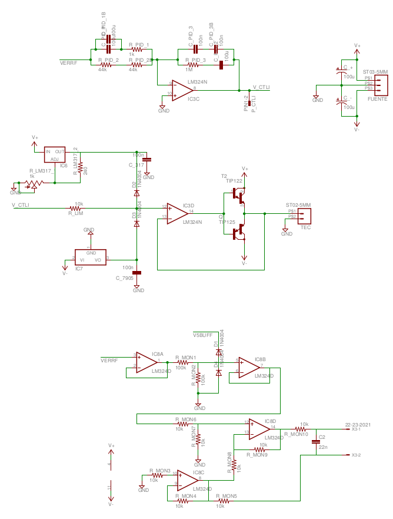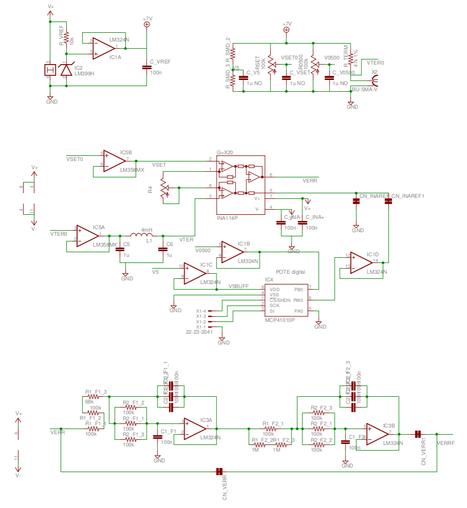

-------

<p align="center">
<strong>
<a href="TEC_controller">Driver TEC</a>
</strong>
</p>

-------


## Controlador central basado en Arduino

Es un *shield* para [Arduino MEGA 2560](https://store.arduino.cc/usa/mega-2560-r3) que permite incorporarle:

  * Generador de barridos triangulares que incluye:
    * Control de frecuencia
    * Control de amplitud de barrido
    * Control de off-set
  * ADC con amplificación y offset
  * DACs a base de PWM y pasabajos

### Diseño de circuito

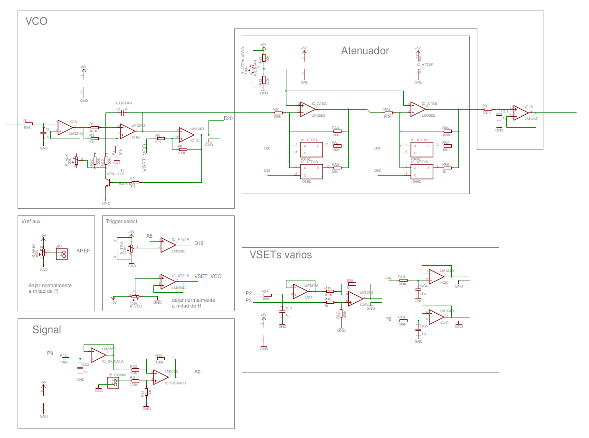
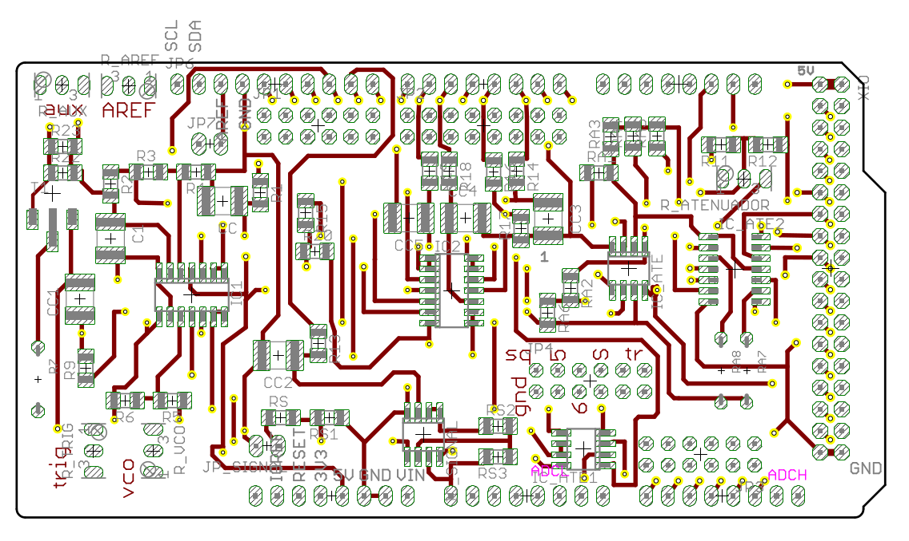 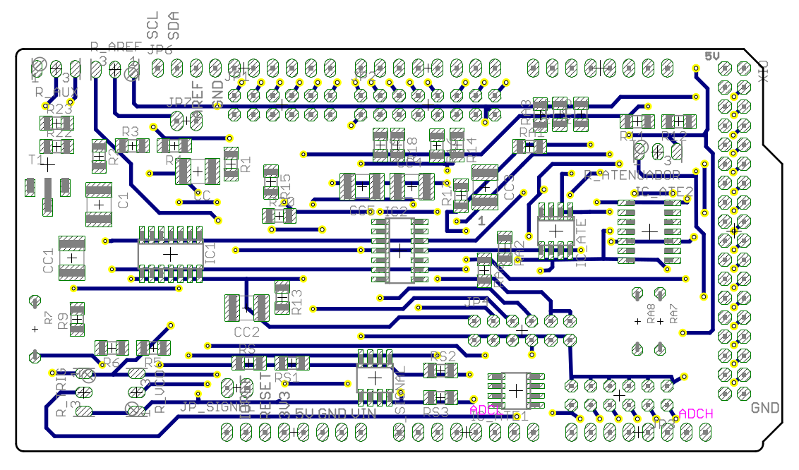


-------

<p align="center">
<strong>
<a href="shield-control">Arduino Shield-Control</a>
</strong>
</p>

-------

### Centro de comandos

Se programó el dispositivo para correr un [centro de comandos](command_center) con comunicación serie para controlar el comportamiento del controlador, configurar parámetros y adquirir datos.


```graphql
# Los comandos se componen de la siguiente estructura:
# (comando)( )(param1)[ ][param2]
# donde () implica obligatorio, [] opcional y ( ) es un white_space


# debug modes
# 0   --> nada de debug
# >=5 --> info irrelevante


Comandos

get -----> P(2-13)  ---> Trae ultimo valor seteado al pin Px
      |--> D(24-29) ---> Lee valor digital del pin Dx
      |--> D(30-39) ---> Trae ultimo valor seteado al pin Dx
      |--> A(0-4)   ---> Lee valor analogico del pin Ax (pin x+54)

set -----> P(2-13) (0-255) ---> Setea el PWM Px en un valor 0-255
      |--> D(30-39) (0-1)  ---> Setea el pin digital Dx en un valor 0-1

debug ---> (num)          ---> Setea el modo de debugging en el valor "num"

trig ---> (off||up||down) ---> Habilita el trigger en el pin 19 para subida, bajada, o lo apaga

binary --> (num)          ---> Si num>0 habilita el modo binario. Sino, lo deshabilita.

vref ---> (num)   ---> Cambia la tensión de referencia del ADC
                          |--> num=1  ---> Vref=1.1V
                          |--> num=2  ---> Vref=2.56V
                          |--> num=9  ---> Vref externo
                          |--> cualquier otro ---> Vref=Vcc~5V (DEFAULT)

curv  ----> A(0-4)   ---> Levanta NN puntos del pin Ax

curv2 ----> A(0-4) ----> D(19-20||30-39)   ---> Levanta NN puntos del pin Ax y otra de NN puntos del pin Dx

# En modo binario las respuestas son:

--> 0 EOT                    ---> Comando recibido
--> 1 EOT Val EOT            ---> Envio de un integer binario
--> 2 EOT Num EOT Vals EOT   ---> Envio de Num integers binarios
--> 9 EOT msg EOT            ---> Envio de un texto informativo

```


<details>
<summary>Ejemplo de comando remoto en Matlab</summary>

```MATLAB

%s=serial('/dev/ttyACM1');
s=serial('COM6');
set(s,'BaudRate',57600);
set(s,'InputBufferSize',4096);


% Nota: para que el MATLAB lea correctamente el puerto es necesario
%       crear un archivo en el home folder donde abre el matlab
%       que en mi caso es /home/lolo
%
%       Archivo: java.opts
%       -Dgnu.io.rxtx.SerialPorts=/dev/ttyS0:/dev/ttyS1:/dev/USB0:/dev/ttyACM0:/dev/ttyACM1
%

fopen(s)
pause(2)
leer(s)

cmd(s,'binary 1')
cmd(s,'trig up')
cmd(s,'trig down')
cmd(s,'trig off')


leer(s)

escribir(s,'\n')

for i=1:20
    plot(cmd(s,'curv A0')*5/1024,'.-')
    pause(0.1)
end

escala=1024

cmd(s,'ate 15')
cmd(s,'set P9 115')

[yy,tt]=curvA0(s);
plot(tt,yy,'.-')
plot(tt,smooth(yy),'.-')

cmd(s,'vref 9')
cmd(s,'delay 250 u')

cmd(s,'set P10 150')
cmd(s,'set P10 0')
cmd(s,'set P9 100')

cmd(s,'set D30 0')
cmd(s,'set D32 0')
cmd(s,'set D34 0')
cmd(s,'set D36 1')

cmd(s,'vref 5')
cmd(s,'vref 1')

tic()
cmd(s,'curv2 A0 D26')
toc()

fclose(s)
```

</details>
