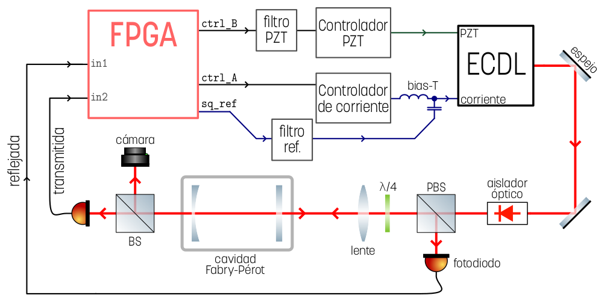
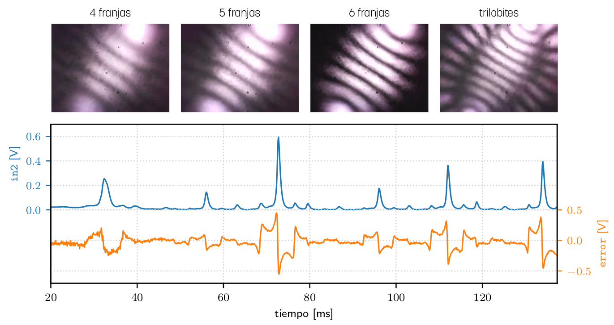
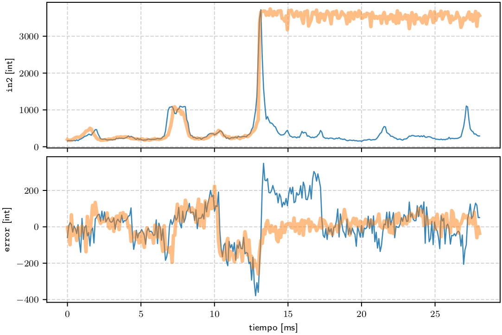

# Capítulo 15: Estabilización de λ a Fabry-Perot mediante PDH

En este capítulo se expone el uso del sistema de estabilización en FPGA para fijar la longitud de onda de emisión de un ECDL a uno de los modos de una cavidad Fabry-Perot.

Sincronizando la variación de corriente y tensión de PZT se hicieron barridos de λ midiendo la intensidad de luz reflejada (para demodulación, en naranja), transmitida (para relevamiento del espectro, en azul) y la forma de de los modos con una cámara.

En este video se muestra un barrido en el que se inicia la estabilización a uno de los modos, que permanece fijo hacia el final.

En este gráfico se muestran las mediciones de intensidad de luz reflejada y demodulada (señal de error) y transmitida (in2) para dos condiciones: un barrido completo (azul) y el inicio de estabilización:

