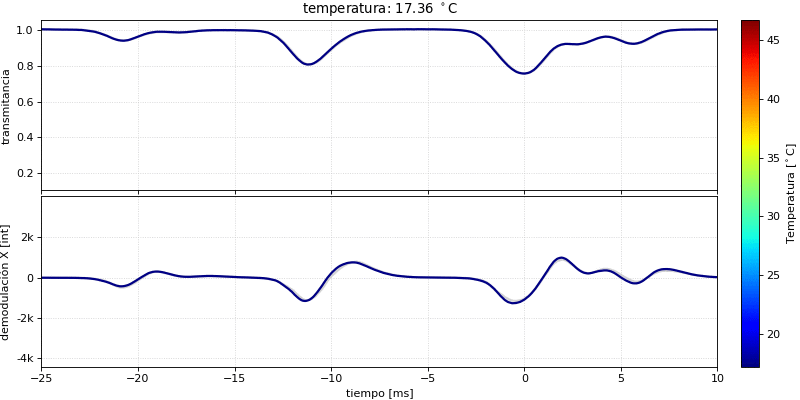
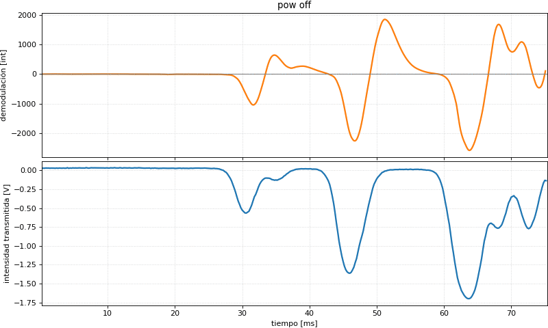

# Capítulo 18: Espectro de absorción y control de λ

En este capítulo se midió el espectro de absorción de la línea D1 del Rubidio 87 en diferentes condiciones, buscando identificar la posición en la que se entra en un esquema de excitación Λ.

## Variación del espectro de transmitancia con la temperatura (haz monocromático)

## Variación del espectro de transmitancia con haz policromático, para distintas potencias de RF

