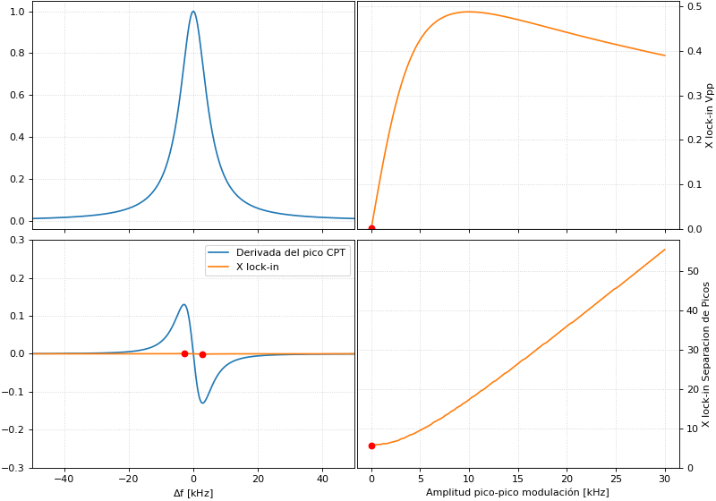

# Capítulo 19: Espectro de CPT y control de RF

En este capítulo se midió el espectro de transparencia inducida por CPT y se identificó el pico correspondiente a una transición de reloj.

## Simulación de la variación del espectro con la amplitud de modulación

