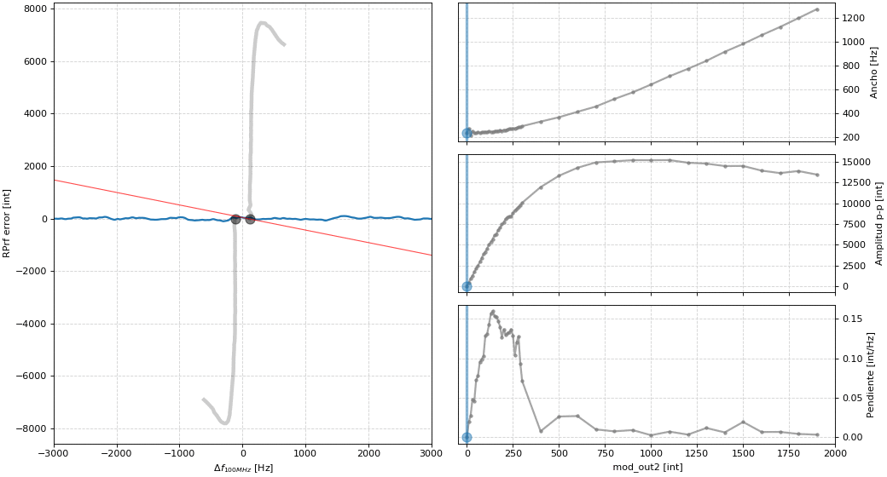
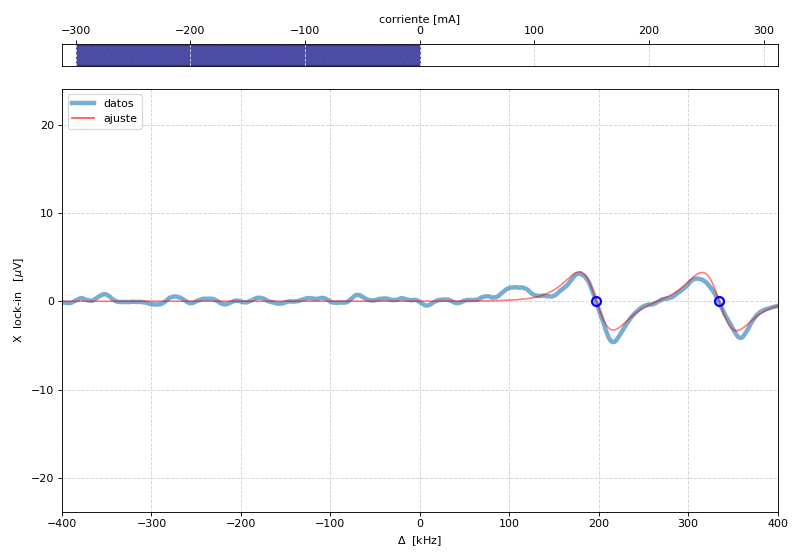

# Capítulo 19: Espectro de CPT y control de RF

En este capítulo se midió el espectro de transparencia inducida por CPT y se identificó el pico correspondiente a una transición de reloj.

## Simulación de la variación del espectro con la amplitud de modulación

## Medición de la variación del espectro con la amplitud de modulación

A diferencia de los gráficos de la tesis, este está expresado en diferencias de frecuencia respecto a la central del VCO (100 MHz).

## Medición de la variación del espectro con el campo magnético

La corriente a la que hace referencia el gráfico es la de la bobina que porduce el campo magnético. Se estima una tasa de conversión de 84(5) G/A.
